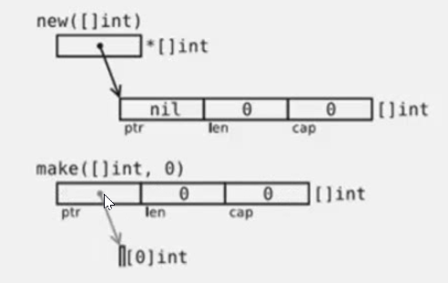

<!-- TOC -->

- [内置函数](#内置函数)
	- [close--主要用来关闭channel](#close--主要用来关闭channel)
	- [len--用来求长度](#len--用来求长度)
	- [new--用来分配内存(值类型)](#new--用来分配内存值类型)
	- [make--用来分配内存(引用类型)](#make--用来分配内存引用类型)
	- [append--用来追加元素到数组](#append--用来追加元素到数组)
	- [panic和recover--用来做错误处理](#panic和recover--用来做错误处理)
	- [new和make的区别](#new和make的区别)

<!-- /TOC -->
# 内置函数
## close--主要用来关闭channel

## len--用来求长度
>比如string、arrav、slice、map、channel

## new--用来分配内存(值类型)
>主要用来分配值类型内存，比如int、struct。返回的是指针
```go
func main() {
	var i int
	fmt.Println(i)

	j := new(int) //返回一个地址
	*j = 100 //为j赋值，需要使用*j来赋值，因为j是一个地址
	fmt.Println(*j)

}
```

## make--用来分配内存(引用类型)
>主要用来分配引用类型，比如chan、map、slice


## append--用来追加元素到数组
>用来追加元素到数组、slice中
```go
func main() {
	var a []int                 //定义一个切片，[]如果是空的话是切片，[5]是一个长度为5的数组
	a = append(a, 10, 20, 3242) //在a这个切片里面追加一些数值
	a = append(a, a...)         //a... 意思是把a这个切片展开
	fmt.Println(a)

}
```
## panic和recover--用来做错误处理
```go
package main

import (
	"errors"
	"fmt"
	"time"
)

//定义一个报错函数
func initConfig() (err error) {
	return errors.New("init config failed ")
}

// recover和panic的使用
func test() {
	defer func() { //定义一个错误捕获匿名函数
		if err := recover(); err != nil {
			fmt.Println(err)
		}
	}()  //在末尾添加（）表示执行定义的匿名函数
	
	b := 0
	a := 100 / b
	fmt.Println(a)
	//主动抛出异常
	err := initConfig()
	if err != nil {
		panic(err)
	}
	return
}

func main() {
	for {
		test()
		time.Sleep(time.Second)
	}
	var a []int                 //定义一个切片，[]如果是空的话是切片，[5]是一个长度为5的数组
	a = append(a, 10, 20, 3242) //在a这个切片里面追加一些数值
	a = append(a, a...)         //a... 意思是把a这个切片展开
	fmt.Println(a)

}

```

## new和make的区别


```go
package main

import "fmt"

func test() {
	s1 := new([]int) //声明一个切片（slice）

	fmt.Println(s1) //返回指针    &[]

	s2 := make([]int, 10) //长度为10的切片    [0 0 0 0 0 0 0 0 0 0]
	fmt.Println(s2)

	*s1 = make([]int, 5) //初始化slice，s1,这里分配5个容量的空间，默认填充0
	(*s1)[0] = 100       //给s1赋值索引0添加值 返回：&[100 0 0 0 0]
	s2[0] = 100          //给s2中索引0添加值，返回：[100 0 0 0 0 0 0 0 0 0]
	fmt.Println(s1, s2)
	return
}

func main() {
	test()
}
```
